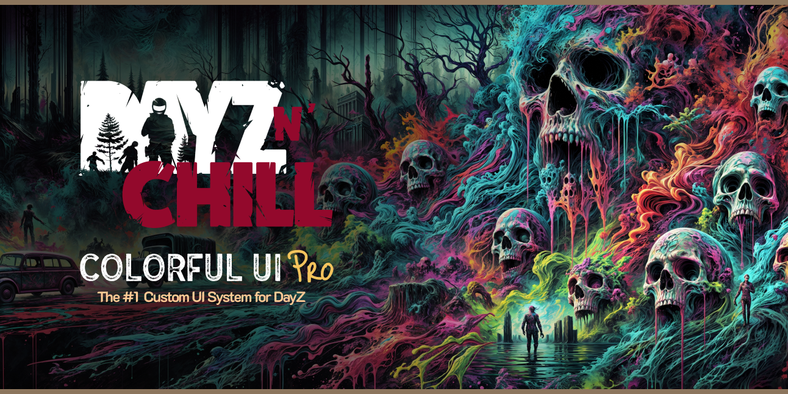

# Colorful UI Pro



## Features
- Fully Responsive Design (UHD & Ultrawide Supported)
- Loading Screen with Synced BG Images & Tips
- Main Menu with Static BG Image and Custom Music
- Modified layout on all Default Layouts
- Easily Editable Layout Files with Prefab Elements
- Simple Configuration
- Customize EVERY ELEMENT INDIVIDUALLY
- Death Screen
- NO MOD DEPENDENCIES

# Installation Guide

## Step 1 — Install required tools

- [Git](https://git-scm.com/)
- [Git LFS](https://git-lfs.github.com/)
- DayZ (Steam)
- DayZ Tools (Steam, free)
- DayZ Server (Steam, free)

## Step 2 — Use this template

- Go to https://github.com/DayZ-n-Chill/Colorful-UI-Pro
- Click the green **`Use this template`** → **`Create a new repository`**
- Name your new repo, click **`Create repository from template`**

## Step 3 — Clone YOUR new repo

Clone to a project drive, NOT your `P:\` drive:

```sh
git clone https://github.com/<your-username>/<your-repo>.git
```

## Step 4 — Mount the P drive

Open DayZ Tools once to mount `P:\`, or run:

```powershell
subst P: "C:\Program Files (x86)\Steam\steamapps\common\DayZ Tools\Bin\Work"
```

## Step 5 — Create the project junction

Double-click `Start.bat` in the repo root. It finds this repo wherever you cloned it, mounts `P:\` if needed, and links `P:\Colorful-UI` to the repo's `Colorful-UI` folder. Safe to re-run any time — it only ever replaces links, never real folders.

Or do it manually (replace `<repo-path>` with the path you cloned to in Step 3):

```powershell
New-Item -ItemType Junction -Path "P:\Colorful-UI" -Target "<repo-path>\Colorful-UI"
```

## Step 6 — Edit your UI

Open `Colorful-UI\Scripts\3_Game\Config\Settings.c` and edit:

- `class Branding` — your logo path
- `class CustomURL` — your website / priority queue / custom link
- `class SocialURL` — Discord / Facebook / Twitter / Reddit / Youtube (set to `"#"` to hide a button)
- `SERVER_IP` / `SERVER_PORT`
- Feature flags: `StartMainMenu`, `NoHints`, `UseImagesets`, `LoadVideo`, `EnableMenuVideo`, `EnableOptionsVideo`, `VideoDeathScreens`

Other edit points:

- `Colorful-UI\Scripts\Data\hints.json` — loading-screen hints
- `Colorful-UI\GUI\sounds\MainMenu\` — drop your `.ogg` files here, update `CfgSoundShaders` in `Colorful-UI\Scripts\config.cpp`
- `Colorful-UI\GUI\textures\Shared\` — your logo `.edds`

To edit in Workbench: open `Colorful-UI\Workbench\dayz.gproj`.

## Step 7 — Build and test (the easy way)

Open the **`tools/`** folder and double-click:

| Double-click this | And it… |
|---|---|
| **`Build and Run Server.bat`** | Builds the mod, launches a local test server + the game. **Start here.** |
| **`Run Server.bat`** | Launches with the last build — skips rebuilding. |
| **`Build Mods.bat`** | Just packs `Colorful-UI.pbo`, no launch. |
| **`Stop Server.bat`** | Shuts the local server + game down. |

First launch finds DayZ / DayZ Server / DayZ Tools on any drive, mounts `P:\`, links `P:\Colorful-UI`, and copies the Chernarus mission into `.server\`. Extra Workshop mods to load alongside go in `tools\mods.txt`, one per line.

The build output is a single `P:\Mods\@Colorful-UI\Addons\Colorful-UI.pbo`. **Note:** script edits are NOT picked up live via `-filePatching` here — rebuild (`Build and Run Server.bat`) after changing `.c` or `.layout` files.

## Step 8 — Build by hand (optional)

```powershell
$ab = 'C:\Program Files (x86)\Steam\steamapps\common\DayZ Tools\Bin\AddonBuilder\AddonBuilder.exe'
& $ab 'P:\Colorful-UI' 'P:\Mods\@Colorful-UI\Addons' '-prefix=Colorful-UI' '-temp=P:	emp\Colorful-UI'
```

## Step 9 — Deploy to a live server

1. Copy `P:\Mods\@Colorful-UI\` to your server root.
2. Copy `@Colorful-UI\Keys\*.bikey` to the server's `keys\` folder.
3. Add `-mod=@Colorful-UI` to your server startup line.
4. Players must have the same `@Colorful-UI` client-side.

# License

[CC BY-NC 4.0](LICENSE.md) — Attribution-NonCommercial.
